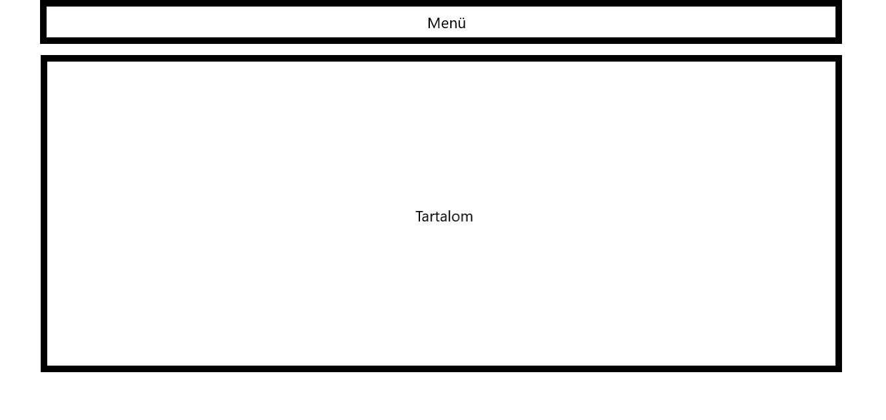
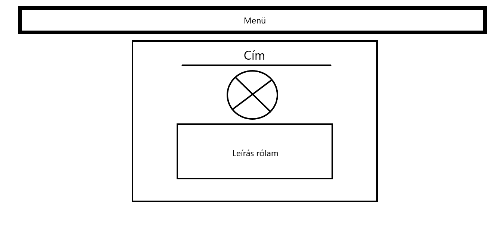
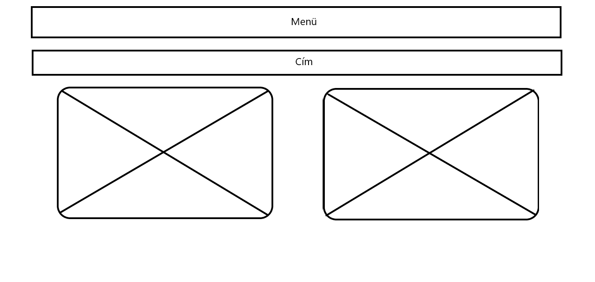
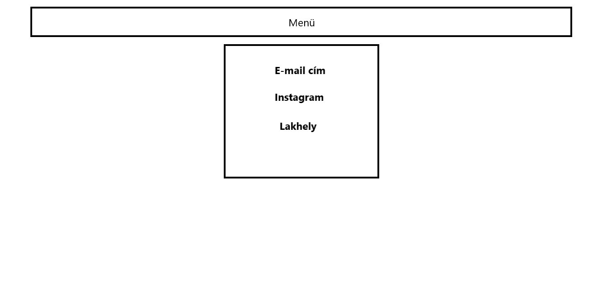

<!DOCTYPE html>
<html lang="hu">
    <head>
        <meta name="viewport" content="width=device-width, initial-scale=1.0">
        <meta http-equiv="Content-Type" content="text/html;charset=UTF-8">
        <title>Rólam</title>
        <link rel="stylesheet" href="alap.css">
    </head>
    <body>
        <nav>
            

                

                    

                        <ul>
                            <li><a href="index.html">Rólam</a></li>
                            <li><a href="hobbi.html">Hobbi</a></li>
                            <li><a href="elerhetoseg.html">Elérhetőség</a></li>
                            <li><a href="feladatleiras.html">Feladatleírás</a></li>
                        </ul>
                    

                

            

        </nav>
        

            <h1>Az oldalak keretének felépítése:</h1>
            

        

        

            
        

        

            <h1>A Rólam oldal felépítése:</h1>
            

        

        

            
        

        

            <h1>A Hobbi oldal felépítése:</h1>
            

        

        

            
        

        

            <h1>Az elérhetőség oldal felépítése:</h1>
            

        

        

            
        

        

            <h2>Felhasznált weboldalak</h2>
        

        

            

                <a href="https://www.w3schools.com/">W3Schools</a>
                 
                <a href="https://css-tricks.com/examples/hrs/">CSS-tricks</a>
            

        

    </body>
</html>
