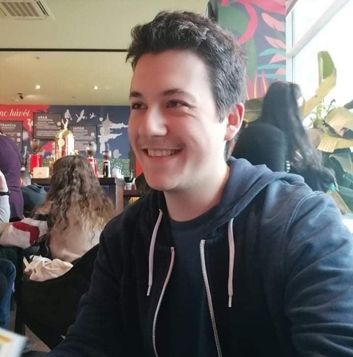

<!DOCTYPE html>
<html lang="hu">
    <head>
        <meta name="viewport" content="width=device-width, initial-scale=1.0">
        <meta http-equiv="Content-Type" content="text/html;charset=UTF-8">
        <title>Rólam</title>
        <link rel="stylesheet" href="alap.css">
    </head>
    <body>
        <nav>
            

                

                    

                        <ul>
                            <li><a href="index.md">Rólam</a></li>
                            <li><a href="hobbi.md">Hobbi</a></li>
                            <li><a href="elerhetoseg.md">Elérhetőség</a></li>
                            <li><a href="feladatleiras.md">Feladatleírás</a></li>
                        </ul>
                    

                

            

        </nav>
        

            

                <h1>Rólam</h1>
                

                
                
Kovács Győző Dávid vagyok, jelenleg a Budapesti Műszaki és Gazdaságtudományi Egyetem gépészmérnöki alapszakján végzem tanulmányaimat és épületgépészeti irányba tervezem a specializálódásomat. Hobbim a zenélés, illetve az asztaloskodás.

                
Ezekben és az élet más területein is az alkotás vágya motivál és ösztönöz arra, hogy amit csinálok, azt a tőlem telhető legmagasabb szinten tegyem és folyamatosan fejlesszem magam.

            

        

    </body>
</html>
